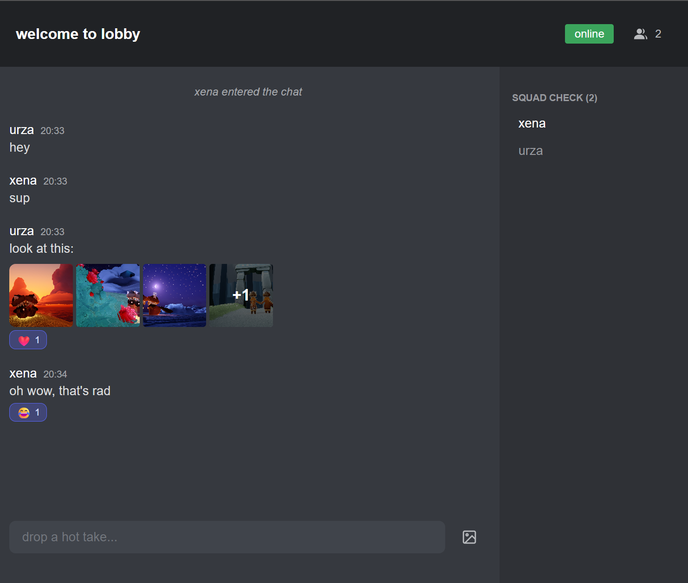

# Yap

Super minimalistic self hosted chat inspired by Discord aesthetics




## Run with Docker

```bash
docker run -d --name yap -p 5221:8080 -v ./uploads:/app/wwwroot/uploads ghcr.io/urza/yap:latest
```

Access at `http://localhost:5221` - it's up to you how to make this accessible for others. For example use some reverse proxy like nginx proxy manager - https://nginxproxymanager.com/

## Features

- **No registration required** - Just log in with username
- **No database** - Messages live in memory and wipe out with app reset
- **User status** - Online (green), Away (orange), Invisible (gray) with status selector
- **Multiple rooms** - Create and switch between chat rooms (admin only)
- **Direct messages** - Private conversations between users
- **Image sharing** - Upload image(s) and see them in inline gallery
- **Emoji support** - Beautiful Twemoji rendering
- **Message actions** - Discord-style hover popup with reactions, edit, delete
- **Reactions** - React to messages with emojis
- **Customizable labels in config** - Fun defaults
- **Tab notifications** - Unread count in browser tab + audio notifications
- **Chat history** - Configurable messages per channel (default 100)
- **Typing indicators** - See who's typing
- **Online users** - See who's currently in the chat with status indicators
- **Resilient reconnection** - Auto-reconnect with session restoration
- **Dark theme** - Discord-inspired UI
- **Mobile responsive** - Works great on all devices with collapsible sidebar


## Architecture

Single-project Blazor Server application with .NET 10:

```
Yap/
├── Components/
│   ├── Layout/
│   │   ├── ChatLayout.razor         # Main chat layout
│   │   └── ReconnectModal.razor     # Reconnection banner
│   ├── Pages/
│   │   ├── Home.razor               # Login screen
│   │   ├── RoomChat.razor           # Room chat (/lobby, /room/{id})
│   │   └── DmChat.razor             # Direct messages (/dm/{user})
│   ├── ChatHeader.razor             # Header with mailbox indicator
│   ├── ChatSidebar.razor            # Rooms and users list
│   └── MessageInput.razor           # Message input with file upload
├── Services/
│   ├── ChatService.cs               # Real-time chat logic
│   ├── UserStateService.cs          # User identity (persistent)
│   ├── ChatNavigationState.cs       # Navigation state (persistent)
│   └── EmojiService.cs              # Emoji rendering
├── wwwroot/
│   ├── js/chat.js                   # Tab notifications
│   ├── uploads/                     # Image storage
│   └── notif.mp3                    # Notification sound
└── appsettings.json                 # Configuration
```

### How Real-time Works

Blazor Server maintains a persistent SignalR (WebSocket) connection for UI updates. We use this same connection for chat:

1. `ChatService` (singleton) holds chat state and raises events
2. Components subscribe to these events
3. When someone sends a message, all subscribers get notified
4. Components call `StateHasChanged()` to push updates to browsers

No custom SignalR hub needed - Blazor's built-in circuit handles everything.

### Resilient Reconnection (.NET 10)

When connection is lost (laptop sleep, network issues):
- Discord-style banner appears with retry countdown
- Infinite retries every 4 seconds
- Circuit kept alive for 4 hours on server
- If circuit expires, session auto-restores via persistent state
- Username and current room preserved across reconnections


## Using the Chat

1. Enter your username on the welcome screen
2. Start chatting - press Enter to send messages
3. Use emojis naturally - they render as Twemoji SVGs
4. Click the image button to upload pictures (supports multiple selection)
5. Drag and drop images directly onto the message input area
6. Hover over messages to react, edit, or delete
7. Click on a user to start a direct message
8. Toggle the sidebar on mobile to see online users

## Configuration - change the app labels in your instance

Edit `appsettings.json` to customize:

```json
{
  "ChatSettings": {
    "ProjectName": "Yap",
    "RoomName": "lobby",
    "ClearUploadsOnStart": true,
    "MaxMessagesPerChannel": 100,
    "FunnyTexts": {
      "WelcomeMessages": ["welcome to {0}", "you ready?"],
      "JoinButtonTexts": ["lessgo", "slide in", "hop on"],
      "SystemMessages": {
        "UserJoined": ["{0} just dropped", "{0} pulled up"],
        "UserLeft": ["{0} dipped", "{0} ghosted us"]
      }
    }
  }
}
```

## File Upload Limits

- Maximum file size: 100MB per file
- Maximum files per upload: 10
- Supported formats: JPEG, PNG, GIF, WebP
- Drag & drop: Supported

## Tech Stack

- **Framework**: Blazor Server (.NET 10)
- **Real-time**: Blazor circuit (built-in SignalR)
- **State Persistence**: `[PersistentState]` for session restoration
- **Styling**: Scoped CSS with Discord-inspired dark theme
- **Emojis**: Twemoji v16

## Contributing

Contributions are welcome! Please feel free to submit a Pull Request.

## License

This project is open source and available under the MIT License.
