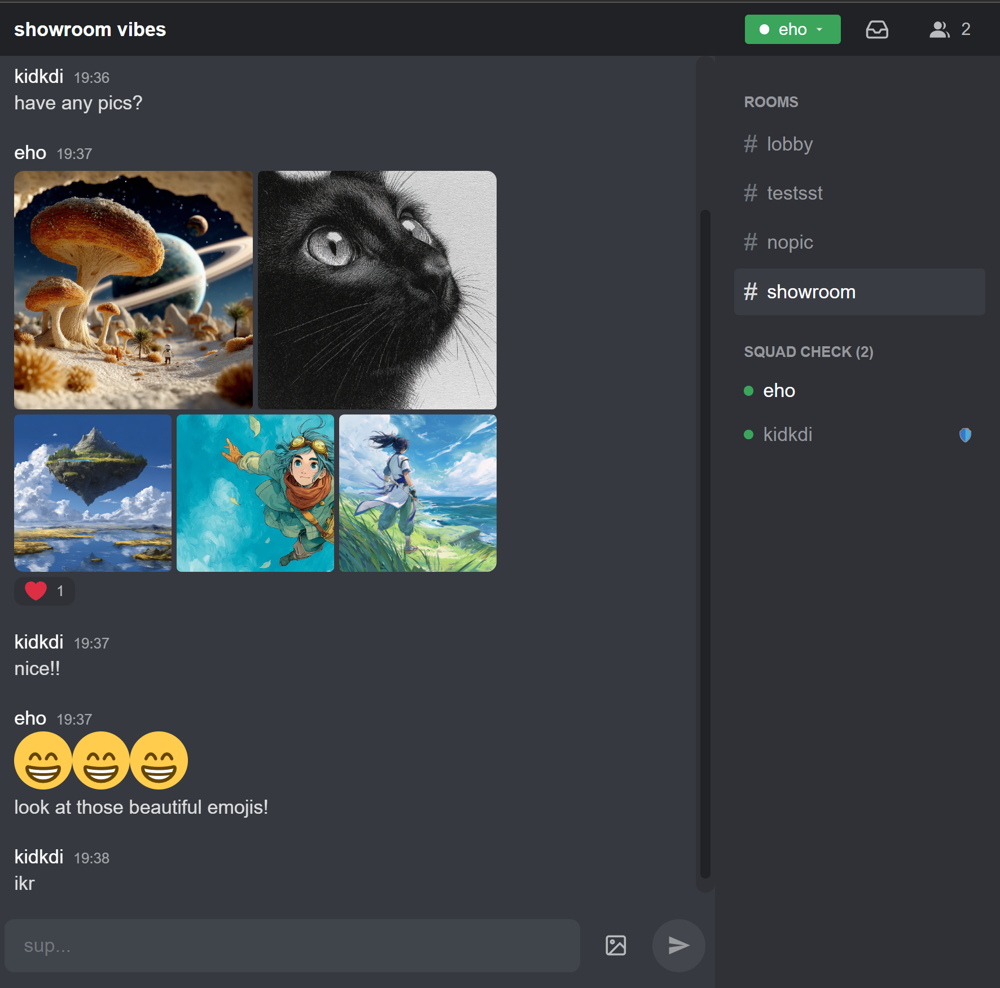

# Yap

Self hosted community chat inspired by Discord aesthetics




## Run with Docker

```bash
docker run -d --name yap -p 5221:8080 -v ./uploads:/app/wwwroot/uploads -v ./data:/app/Data ghcr.io/urza/yap:latest
```

There are two volumes:
- "uploads" which holds media (pictures) uploaded by users
- "data" which contains configuration (appsettings.json), SQLite db (if enabled), and custom emojis

Access at `http://localhost:5221` - it's up to you how to make this accessible for others. For example use some reverse proxy like nginx proxy manager  (https://nginxproxymanager.com/) or cloudflare tunnel.

## Features

- **No registration required** - Just log in with username, no passwords or social logins
- **User profiles** - Set profile picture, display name, and bio; avatars shown in chat
- **Database optional** - Everything can be ephemeral and live only in memory (wiped on app reset) or you can use SQLite for persistence
- **Customizable labels in config** - make it fun or serious
- **Emoji support** - Beautiful Twemoji rendering 
- **Custom emojis** - Drop image files into `Data/custom-emojis/` (data volume) folder and they become available for your users
- **Gifs** - gifs by Klipy + your own, server collections curated by server admin, user favs + customs, bulk import / export
- **Themes** - Dark, Midnight, Nord, Ocean, Sunset, Aurora, Daylight
- **Multiple rooms/channels** - admin can create new, nobody will come anyway
- **Direct messages** - Private conversations between users, not encrypted, treat accordingly
- **Message actions** - Discord-style hover popup with reactions, edit, delete
- **Reactions** - React to messages with emojis, even custom ones
- **Tab notifications** - Unread count in browser tab + audio notifications
- **Typing indicators** - See who's typing with customizable messages
- **Mobile responsive** - Works great(TM) on all devices with collapsible sidebar
- **PWA installable** - Add to home screen on mobile, install as app on desktop, get notifications
- **Image/Video sharing** - Upload image(s) or videos and see them in inline gallery
- **Social media previews/embeds** - Yap downloads that tiktok/youtube video so users dont need to go to these evil sites

## License

This project is open source and available under the MIT License.
