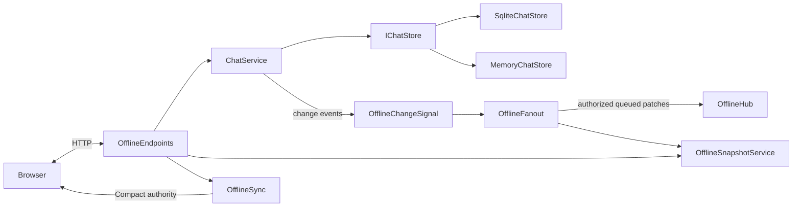

# Chat transport and synchronization

This folder is the server interface for the browser chat client, during ordinary online use and recovery after an outage. The `Offline` name refers to that client's offline capability; local drafts, queues and caches live in [`wwwroot/chat-client`](../wwwroot/chat-client/).

The folder groups related HTTP/SignalR adapters and projections inside the existing ASP.NET application. Business rules and durable acceptance stay in the shared chat/media services. Login, Settings and Admin retain their Blazor surfaces.

## Types and responsibilities

| Type | Purpose |
| --- | --- |
| [ChatRoutes](ChatRoutes.cs) | Identifies shell, API and hub paths for middleware policy. |
| [OfflineEndpoints](OfflineEndpoints.cs) | Maps the shell and `/api/chat` routes; applies authentication, no-store responses and account-bound antiforgery protection for writes. Delegates sends, mutations, reads and history to shared services. |
| [OfflineContent](OfflineContent.cs) | Adds catalog, emoji, GIF and completed-upload routes to the protected API group. Resolves media references for message acceptance through existing services. |
| [OfflineSnapshotService](OfflineSnapshotService.cs) | Builds each user's authorized recent windows and safe DTOs, with a content revision and server epoch/sequence for reconciliation. Also projects individual messages/conversations. |
| [OfflineSync](OfflineSync.cs) | Builds protocol-3 bootstrap, on-demand windows and compact acknowledgements using content counters. `ReaderMessage`, `ConversationUpdate` and `ChatUpdate` define the wire packets. |
| [OfflineChangeSignal](../Services/OfflineChangeSignal.cs) | Receives explicit `Touch` calls from committed-state publishers, assigns sequences and tracks conversation content/history versions. |
| [OfflineFanout](OfflineFanout.cs) | Projects each message event once, applies viewer authorization, and routes it to bounded per-connection queues. Coalesces pending entries; overflow recovers through invalidation. |
| [OfflineHub](OfflineHub.cs) | Serves `/hubs/chat`: `WatchChanges` streams deltas, `WatchActivity` joins and streams changed presence/typing fields, and hub methods report activity/status/typing. Revalidates the account while streams run. |
| [OfflineLiveService](OfflineLiveService.cs) | Owns connection tickets and transient session bookkeeping, coordinating presence and typing with `ChatService`. |
| [OfflinePresenceTicker](OfflineLiveService.cs) | Publishes changed presence/typing views on the shared 100 ms ticker. Disconnect timers belong to `ChatService`. |

`Reader*` records in `OfflineSnapshotService.cs` define the client-facing snapshot shapes. `LivePerson`/`LiveView` describe transient live state; the private `Session` record holds its connection lifecycle. Nested records in the endpoint/content classes define request bodies. These transport types deliberately avoid serializing persistence entities and credentials.

## How the pieces work together

1. **Connect and read.** Bootstrap validates the cookie and supplies an account-bound antiforgery token and short-lived live-session ticket. It returns summaries and the active recent window; matching cached revisions omit unchanged message bodies. Missing windows fill in the background. `OfflineSnapshotService` constructs the authorized state and `OfflineSync` shapes the wire response. Snapshot construction reads the shared services; this folder does not maintain a second message database.
2. **Accept a write.** `OfflineEndpoints` passes the authenticated operation to `ChatService.Text`, `.Actions` or `.Reads`. Message/mutation receipts are accepted through `IChatStore`, backed by SQLite or process memory; the HTTP response includes compact current authority for the browser to reconcile. `OfflineContent` resolves account-owned uploads or trusted GIF selections when needed.
3. **Notify connected clients.** Shared chat mutations produce one projected event through `OfflineChangeSignal` and `OfflineFanout`. Only subscribed authorized users receive it. Unread, preference and favorite events update only the affected account; profile changes invalidate affected windows. Each connection has one 128-entry queue; pending entries coalesce per conversation without borrowing another conversation’s sequence stamp, and overflow resets through authorized invalidations. Authentication is revalidated while streaming and during idle periods. History versions invalidate older cached pages on mutations while allowing ordinary arrivals to preserve them.
4. **Track live activity.** Hub calls use `OfflineLiveService` to join/report/change status/type. `WatchActivity` registers the session and selected conversation in the streaming call, then publishes changed live fields separately from messages. Report/Typing are ordered sends without a reply dependency; explicit status selection awaits confirmation. Disconnect handling clears visibility/typing immediately; `ChatService.ConnectionDown` owns cancellable disconnect grace/retention timers for both transports. The authenticated `/api/chat/presence/leave` request reports explicit closure and removes only that connection immediately. `OfflinePresenceTicker` drives the shared 100 ms presence projection ticker; it does not sweep session lifetimes. People and per-channel typing are built once per tick; unchanged views are not sent. Per-method connection limits allow 12-call bursts and four sustained calls/second.

## Wiring and boundaries

[`Program.cs`](../Program.cs) registers the projection, sync, fan-out, change and live services as singletons, and `OfflinePresenceTicker` as a hosted service. `MapOfflineChat()` maps the shell, HTTP routes and hub. Middleware uses `ChatRoutes` for API/hub policy and validates hub handshakes; API filters and hub methods enforce their respective request/stream boundaries.

Proxy compatibility is permissive by default: forwarded scheme/client IP do not require an address allowlist; forwarded Host is ignored and optional `PublicOrigin` overrides per-user login-link origins, and chat requests do not compare browser Origin with the internal URL. API writes require account-bound antiforgery tokens; API writes and hub requests reject browser-marked cross-site traffic while accepting missing metadata. Optional proxy restrictions and the trust trade-off are described in the [deployment guide](../../GHCR-DEPLOYMENT-GUIDE.md#https-reverse-proxies-and-caches).

Keep authorization, receipt compatibility and snapshot ordering intact when changing these adapters. Persistent messages/receipts belong to the shared services; browser drafts/outbox belong to the client; connection presence/typing belongs to the live service. Window capture and event projection share the conversation lock; there is no process-wide snapshot lock or content hashing. The old `Watch` stream and protocol-1 bootstrap/write responses are removed. The diagnostic `/sync` route is removed. History and stream/window paths serialize the same message record with separate authors. Ten-second metadata digests repair dropped revisions.

For the wider design, see [architecture](../../docs/offline-client-architecture.md), [offline behavior](../../docs/offline-behavior.md) and [features/parity](../../docs/feature-parity-inventory.md). [Testing instructions](../../tests/browser/README.md) cover the server contract harness and browser recovery checks.

The illustrated [communication guide](../../docs/offline-communication.html) follows startup and maps features and code to HTTP, the chat hub and retained Blazor Server circuits.
